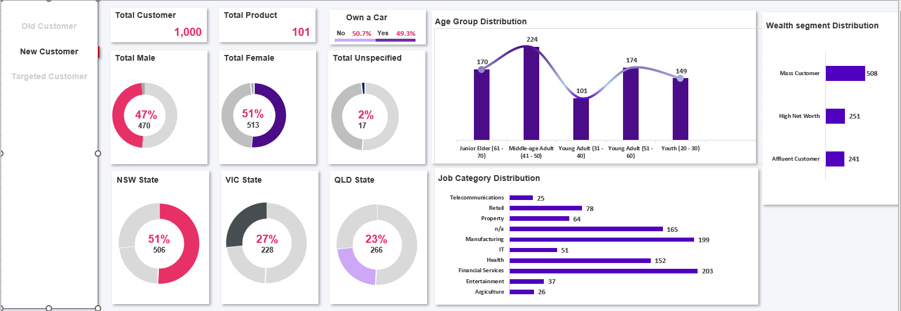
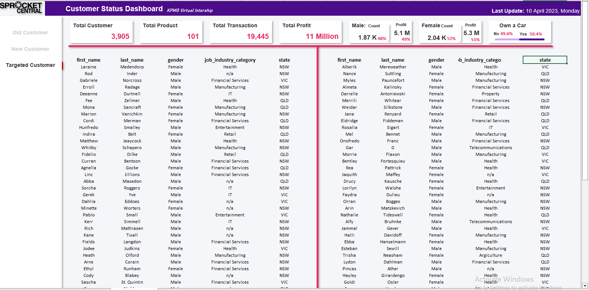

# KPMG--SpRocket-Central-Pty-LTD-
This is a virtual internship of KPMG which was held at  Forage about bike related sales analysis of Sprocket Central Pty Ltd. This internship is divided into three section which are (Data Quality, Data Model, Data Insight). This project will help Sprocket central pty make data driven decisions

<i> Disclaimer: All datasets are from Forage. </i>

<b> About Sprocket Central pty Ltd </b>

Sprocket Central Pty Ltd is a long-standing KPMG client that specializes in high-quality bikes and accessible cycling accessories for riders.

<b> Problem Statement </b>

1. The marketing team is looking to boost business by analyzing its existing customer dataset to determine customer trends and behavior.
2. With the 3 datasets provided, the aim is to identify and recommend 1000 customers that the cycling company should target to drive sales.

<b> Model Development </b>

RMF analysis is used to determine which customers a business should target to increase its revenue and value.
The RMF (Recency, Frequency, and Monetary) model shows customers that have displayed high levels of engagement with the business in the three categories mentioned.

<b> Visualization: </b>
The report comprises 3 pages:

1. Old Customers
2. New Customers
3. Target Customers

## Old Customer

1. The total profit made is $11 Million.
2. Over the past 3 years, about 52% of bike purchases were made by females compared to 48% made by males.
3. The bulk of the bike related purchases were from NSW with the least coming from QLD. NSW has 2086, VIC has 821 purchase, and QLD has 821.
4. Majority of the customers are middle age adulth (41 – 50).
5. With the top 4 best selling job industries are financial services, manufacturing, health and the unknown industries while the worst being telecommunication.
6. The brand with the highest customer purchase is Solex, and WeareA2B (2446 and 2138 customer respectiveely) with the least being Norco bicycles (1922).
7. 99.9% of all transaction are approved.

## New Customer

1. The total number of customers is 1000 with females having 513 (51%), males 470 (47%), and Unspecified 17 (2%) .
2. Majority of the customers are middle age adulth (41 – 51).
3. The top four industries of the new customers are, financial services, manufacturing, health and the unknown industries with the worst being telecommunication.
4. NSW has the largest number of customers and QLD the least.

## Target Customer

